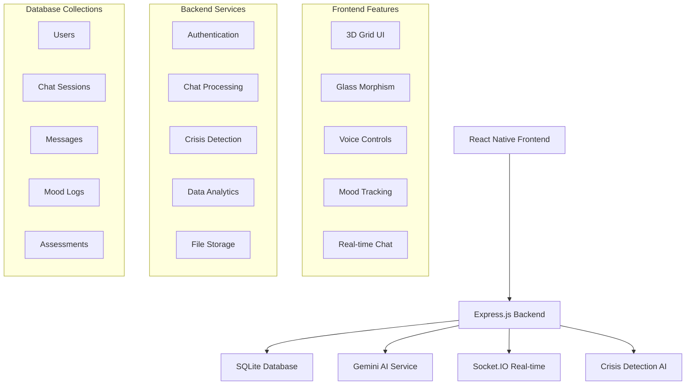

# 🧠 Mental Wellness AI - Full Stack Application

<div align="center">
  
  
  **An AI-powered mental health companion with crisis detection, mood tracking, and professional wellness resources.**
  
  [](https://reactnative.dev/)
  [](https://nodejs.org/)
  [](https://expressjs.com/)
  [](https://sqlite.org/)
  [](https://socket.io/)
  [](https://ai.google.dev/)
</div>

---

## 📋 Table of Contents

- [🌟 Features](#-features)
- [🏗️ Architecture](#️-architecture)
- [🚀 Quick Start](#-quick-start)
- [⚙️ Environment Setup](#️-environment-setup)
- [🔧 Backend Setup](#-backend-setup)
- [🎨 Frontend Setup](#-frontend-setup)
- [🔗 API Documentation](#-api-documentation)
- [🗄️ Database Schema](#️-database-schema)
- [🧪 Testing](#-testing)
- [🚀 Deployment](#-deployment)
- [📱 Mobile App](#-mobile-app)
- [🛡️ Security & Privacy](#️-security--privacy)
- [🤝 Contributing](#-contributing)
- [📄 License](#-license)

---

## 🌟 Features

### 🤖 **AI-Powered Chat**
- **Gemini AI Integration** - Advanced natural language processing
- **Context-Aware Responses** - Maintains conversation context
- **Personalized Interactions** - Adapts to user communication style
- **Multi-language Support** - International accessibility

### 🚨 **Crisis Detection & Safety**
- **Real-time Sentiment Analysis** - Monitors emotional state
- **Crisis Level Assessment** - 5-tier risk evaluation system
- **Emergency Resources** - Immediate access to professional help
- **HIPAA Compliance** - Secure, private data handling

### 📊 **Mood & Wellness Tracking**
- **Daily Mood Check-ins** - Visual mood tracking interface
- **Analytics Dashboard** - Comprehensive mood trends
- **Goal Setting** - Personalized wellness objectives
- **Progress Monitoring** - Track improvement over time

### 🎨 **Modern UI/UX**
- **3D Grid Background** - Immersive visual experience
- **Glass Morphism Design** - Modern, accessible interface
- **Dark/Light Themes** - User preference support
- **Responsive Design** - Mobile-first approach

### 🔊 **Voice & Accessibility**
- **Voice Input/Output** - Hands-free interaction
- **Text-to-Speech** - AI response narration
- **Screen Reader Support** - Full accessibility compliance
- **Keyboard Navigation** - Complete keyboard accessibility

---

## 🏗️ Architecture



---

## 🚀 Quick Start

### Prerequisites

- **Node.js** 18+ ([Download](https://nodejs.org/))
- **npm** or **yarn** package manager
- **SQLite** (bundled with the application)
- **Gemini API Key** ([Get from Google AI Studio](https://makersuite.google.com/app/apikey))

### ⚡ One-Command Setup

```bash
# Clone the repository
git clone https://github.com/your-username/mental-wellness-ai.git
cd mental-wellness-ai

# Run the complete setup script
./scripts/setup-dev.sh
```

### 🔥 Manual Setup (Recommended for Development)

```bash
# 1. Clone and navigate
git clone https://github.com/your-username/mental-wellness-ai.git
cd mental-wellness-ai

# 2. Install dependencies for both frontend and backend
npm run install:all

# 3. Set up environment variables
cp backend/.env.example backend/.env
cp frontend/.env.example frontend/.env

# 4. Start both servers concurrently
npm run dev
```

**Your application will be running at:**
- 🎨 **Frontend**: http://localhost:19006 (Expo Web)
- 🔧 **Backend**: http://localhost:5000 (Express API)
- 📱 **Mobile**: Use Expo Go app to scan QR code

---

## ⚙️ Environment Setup

### 🔧 Backend Environment (`.env`)

Create `backend/.env` with the following configuration:

```bash
# =============================================================================
# MENTAL WELLNESS AI BACKEND CONFIGURATION
# =============================================================================

# Server Configuration
NODE_ENV=development
PORT=5000
FRONTEND_URL=http://localhost:19006

# Database Configuration
DATABASE_PATH=./data/mental-wellness-ai.db

# Authentication & Security
JWT_SECRET=your-super-secure-jwt-secret-key-here
JWT_EXPIRE=7d
BCRYPT_SALT_ROUNDS=12
SESSION_SECRET=your-session-secret-key-here

# AI Services
GEMINI_API_KEY=your-gemini-api-key-here
OPENAI_API_KEY=your-openai-api-key-here-optional

# Crisis Detection
CRISIS_THRESHOLD_HIGH=0.8
CRISIS_THRESHOLD_MEDIUM=0.6
CRISIS_THRESHOLD_LOW=0.4

# Rate Limiting
RATE_LIMIT_WINDOW_MS=900000
RATE_LIMIT_MAX_REQUESTS=100
CHAT_RATE_LIMIT_MAX=30

# Logging
LOG_LEVEL=info
LOG_FILE_PATH=./logs

# External Services
TWILIO_ACCOUNT_SID=your-twilio-sid-optional
TWILIO_AUTH_TOKEN=your-twilio-token-optional
EMERGENCY_CONTACT_NUMBER=+1-800-273-8255

# File Upload
UPLOAD_MAX_SIZE=10485760
ALLOWED_FILE_TYPES=image/jpeg,image/png,image/gif

# Email Configuration (Optional)
SMTP_HOST=smtp.gmail.com
SMTP_PORT=587
SMTP_USER=your-email@gmail.com
SMTP_PASS=your-app-password
```

### 🎨 Frontend Environment (`.env`)

Create `frontend/.env` with the following configuration:

```bash
# =============================================================================
# MENTAL WELLNESS AI FRONTEND CONFIGURATION
# =============================================================================

# API Configuration
EXPO_PUBLIC_API_URL=http://localhost:5000/api
EXPO_PUBLIC_SOCKET_URL=http://localhost:5000

# Gemini AI (Client-side backup)
EXPO_PUBLIC_GEMINI_API_KEY=your-gemini-api-key-here

# App Configuration
EXPO_PUBLIC_APP_NAME=Mental Wellness AI
EXPO_PUBLIC_APP_VERSION=1.0.0

# Feature Flags
EXPO_PUBLIC_ENABLE_VOICE=true
EXPO_PUBLIC_ENABLE_ANALYTICS=true
EXPO_PUBLIC_ENABLE_CRISIS_DETECTION=true

# Theme Configuration
EXPO_PUBLIC_DEFAULT_THEME=light
EXPO_PUBLIC_ENABLE_3D_BACKGROUND=true

# Development
EXPO_PUBLIC_DEBUG_MODE=true
EXPO_PUBLIC_API_TIMEOUT=10000
```

---

## 🔧 Backend Setup

### 📁 Project Structure

```
backend/
├── 📄 server.js              # Main server entry point
├── 📁 routes/                 # API route definitions
│   ├── 🔐 auth.js            # Authentication routes
│   ├── 💬 chat.js            # Chat & messaging routes
│   ├── 👤 user.js            # User management routes
│   └── 📊 assessment.js      # Mental health assessments
├── 📁 models/                 # SQLite schemas
│   ├── 👤 User.js            # User data model
│   ├── 💬 ChatSession.js     # Chat session model
│   ├── 📝 Message.js         # Individual message model
│   └── 📊 MoodLog.js         # Mood tracking model
├── 📁 ai/                     # AI service integrations
│   ├── 🤖 chatService.js     # Gemini AI chat processing
│   └── 🚨 crisisDetection.js # Crisis detection algorithms
├── 📁 middlewares/            # Express middlewares
│   ├── 🔐 auth.js            # JWT authentication
│   ├── 🛡️ hipaa.js           # HIPAA compliance
│   └── ⚠️ errorHandler.js    # Global error handling
└── 📁 tests/                  # Backend test suites
```

### 🚀 Starting the Backend

```bash
cd backend

# Install dependencies
npm install

# Set up environment variables
cp .env.example .env
# Edit .env with your configuration

# Development mode (with auto-reload)
npm run dev

# Production mode
npm start

# Run tests
npm test

# Lint code
npm run lint:fix
```

### 📊 Backend API Health Check

```bash
# Test server connectivity
curl http://localhost:5000/api/health

# Expected response:
{
  "status": "healthy",
  "timestamp": "2025-09-20T10:30:00.000Z",
  "services": {
    "database": "connected",
    "ai": "operational",
    "memory": "12.5MB"
  }
}
```

---

## 🎨 Frontend Setup

### 📁 Project Structure

```
frontend/
├── 📄 App.js                 # Main application component
├── 📁 components/             # Reusable UI components
│   ├── 💬 ChatScreen.tsx     # Main chat interface
│   ├── 😊 MoodCheckIn.tsx    # Mood tracking component
│   ├── 📊 MoodAnalytics.tsx  # Analytics dashboard
│   ├── 🎤 VoiceControls.tsx  # Voice interaction
│   └── 🎯 GoalsReminders.tsx # Goal management
├── 📁 screens/                # Screen components
├── 📁 services/               # API & external services
│   ├── 🔌 apiService.js      # Backend API integration
│   ├── 🤖 geminiService.js   # Direct AI service calls
│   ├── 🎤 voiceService.js    # Speech recognition/synthesis
│   └── 💾 storageService.js  # Local data persistence
├── 📁 hooks/                  # Custom React hooks
│   ├── 🔐 useAuth.js         # Authentication state
│   └── 🎨 useTheme.js        # Theme management
├── 📁 contexts/               # React context providers
├── 📁 assets/                 # Static assets & styling
│   ├── 🎨 theme.js           # Design system configuration
│   └── 🖼️ images/           # Image assets
└── 📁 types/                  # TypeScript type definitions
```

### 🚀 Starting the Frontend

```bash
cd frontend

# Install dependencies
npm install

# Set up environment variables
cp .env.example .env
# Edit .env with your configuration

# Start development server
npm start

# Build for production
npm run build

# Preview production build
npm run preview
```

### 📱 Platform Support

| Platform | Status | Launch Command |
|----------|--------|----------------|
| 🌐 **Web** | ✅ Ready | `npm start` → Press `w` |
| 📱 **iOS** | ✅ Ready | `npm start` → Press `i` |
| 🤖 **Android** | ✅ Ready | `npm start` → Press `a` |

---

## 🔗 API Documentation

### 🔐 Authentication Endpoints

#### Register User
```http
POST /api/auth/register
Content-Type: application/json

{
  "email": "user@example.com",        # Optional for anonymous
  "password": "securePassword123",    # Optional for anonymous
  "age": 25,                          # Required
  "anonymous": true,                  # Default: true
  "termsAccepted": true              # Required
}
```

#### Login User
```http
POST /api/auth/login
Content-Type: application/json

{
  "email": "user@example.com",
  "password": "securePassword123"
}
```

#### Get User Profile
```http
GET /api/auth/profile
Authorization: Bearer <jwt-token>
```

### 💬 Chat Endpoints

#### Send Message
```http
POST /api/chat/message
Authorization: Bearer <jwt-token>
Content-Type: application/json

{
  "message": "I'm feeling anxious today",
  "sessionId": "optional-session-id"
}
```

#### Get Chat History
```http
GET /api/chat/sessions
Authorization: Bearer <jwt-token>

# Query parameters:
# ?limit=20&offset=0&sort=desc
```

#### Get Session Messages
```http
GET /api/chat/sessions/:sessionId/messages
Authorization: Bearer <jwt-token>
```

### 📊 Mood Tracking Endpoints

#### Log Mood Entry
```http
POST /api/mood/log
Authorization: Bearer <jwt-token>
Content-Type: application/json

{
  "mood": 4,                    # 1-5 scale
  "energy": 3,                  # 1-5 scale
  "anxiety": 2,                 # 1-5 scale
  "note": "Feeling better today",
  "activities": ["exercise", "meditation"]
}
```

#### Get Mood Analytics
```http
GET /api/mood/analytics
Authorization: Bearer <jwt-token>

# Query parameters:
# ?period=week&start=2025-09-01&end=2025-09-07
```

### 🚨 Crisis Detection

#### Crisis Assessment
```http
POST /api/crisis/assess
Authorization: Bearer <jwt-token>
Content-Type: application/json

{
  "message": "Text to analyze for crisis indicators",
  "context": "recent conversation context"
}
```

### 🎯 Goals & Assessments

#### Create Wellness Goal
```http
POST /api/goals
Authorization: Bearer <jwt-token>
Content-Type: application/json

{
  "title": "Daily meditation",
  "description": "Meditate for 10 minutes daily",
  "type": "daily",
  "targetValue": 10,
  "targetDate": "2025-12-31"
}
```

---

## 🗄️ Database Schema

### 👤 User Model

```javascript
{
  _id: ObjectId,
  email: String,              // Optional for anonymous users
  passwordHash: String,       // Hashed with bcrypt
  isAnonymous: Boolean,       // Default: true
  profile: {
    age: Number,              // Required for age-appropriate content
    gender: String,           // Optional
    timezone: String,         // Auto-detected
    preferences: {
      theme: String,          // 'light' | 'dark' | 'auto'
      language: String,       // Default: 'en'
      voiceEnabled: Boolean,
      notificationsEnabled: Boolean
    }
  },
  privacy: {
    dataRetention: Number,    // Days to retain data
    shareAnonymousData: Boolean,
    consentedToTerms: Boolean,
    consentDate: Date
  },
  safety: {
    crisisContactEnabled: Boolean,
    emergencyContacts: [String],
    hasSafetyPlan: Boolean
  },
  createdAt: Date,
  lastActive: Date,
  isDeleted: Boolean          // Soft delete for HIPAA compliance
}
```

### 💬 Chat Session Model

```javascript
{
  _id: ObjectId,
  userId: ObjectId,           // Reference to User
  title: String,              // Auto-generated or user-defined
  status: String,             // 'active' | 'archived' | 'deleted'
  metadata: {
    messageCount: Number,
    avgSentiment: Number,     // -1 to 1 scale
    crisisLevel: Number,      // 0-4 scale
    topics: [String],         // AI-extracted topics
    lastAiModel: String       // 'gemini-pro' | 'gpt-4' etc.
  },
  startedAt: Date,
  lastMessageAt: Date,
  archivedAt: Date
}
```

### 📝 Message Model

```javascript
{
  _id: ObjectId,
  sessionId: ObjectId,        // Reference to ChatSession
  role: String,               // 'user' | 'assistant' | 'system'
  content: {
    text: String,
    type: String,             // 'text' | 'image' | 'audio'
    metadata: Object          // Additional data for rich content
  },
  analysis: {
    sentiment: Number,        // -1 to 1 scale
    crisisScore: Number,      // 0-1 probability
    topics: [String],
    intent: String,           // Detected user intent
    confidence: Number        // AI confidence score
  },
  processing: {
    aiModel: String,
    processingTime: Number,   // Milliseconds
    tokenCount: Number
  },
  timestamp: Date,
  isDeleted: Boolean
}
```

### 📊 Mood Log Model

```javascript
{
  _id: ObjectId,
  userId: ObjectId,
  date: Date,                 // Truncated to day for privacy
  mood: {
    overall: Number,          // 1-5 scale
    energy: Number,           // 1-5 scale
    anxiety: Number,          // 1-5 scale
    depression: Number,       // 1-5 scale
    stress: Number,           // 1-5 scale
    sleep: Number             // 1-5 scale (quality)
  },
  activities: [String],       // ['exercise', 'meditation', 'therapy']
  note: String,               // Optional user note
  context: {
    weather: String,          // API integration
    location: String,         // City/region only
    timeOfDay: String         // 'morning' | 'afternoon' | 'evening'
  },
  createdAt: Date
}
```

---

## 🧪 Testing

### 🔧 Backend Testing

```bash
cd backend

# Run all tests
npm test

# Run tests with coverage
npm run test:coverage

# Run specific test suite
npm test -- --testPathPattern=auth

# Watch mode for development
npm run test:watch
```

### Test Structure

```
backend/tests/
├── 🧪 unit/                  # Unit tests
│   ├── auth.test.js
│   ├── chat.test.js
│   └── ai.test.js
├── 🔗 integration/           # Integration tests
│   ├── api.test.js
│   └── database.test.js
└── 🎭 e2e/                   # End-to-end tests
    └── chat-flow.test.js
```

### 🎨 Frontend Testing

```bash
cd frontend

# Run component tests
npm test

# Run with coverage
npm run test:coverage

# Visual regression tests
npm run test:visual
```

### 📊 Test Coverage Goals

- **Backend**: > 90% coverage
- **Frontend**: > 85% coverage
- **Critical Paths**: 100% coverage (auth, crisis detection, chat)

---

## 🚀 Deployment

### 🌐 Production Deployment

#### Backend Deployment (Railway/Heroku)

```bash
# Using Railway
railway login
railway init
railway add database sqlite
railway deploy

# Using Heroku
heroku create mental-wellness-api
heroku addons:create sqlite3:free
git push heroku main
```

#### Frontend Deployment (Vercel/Netlify)

```bash
# Using Vercel
vercel login
vercel init
vercel deploy --prod

# Using Netlify
netlify login
netlify init
netlify deploy --prod
```

### 🐳 Docker Deployment

```bash
# Build and run with Docker Compose
docker-compose up -d

# Scale services
docker-compose up -d --scale backend=3

# View logs
docker-compose logs -f
```

### ☁️ Cloud Infrastructure

```yaml
# docker-compose.yml
version: '3.8'
services:
  frontend:
    build: ./frontend
    ports:
      - "3000:3000"
    environment:
      - REACT_APP_API_URL=http://backend:5000
      
  backend:
    build: ./backend
    ports:
      - "5000:5000"
    environment:
      - DATABASE_PATH=/app/data/mental-wellness.db
      - GEMINI_API_KEY=${GEMINI_API_KEY}
    volumes:
      - sqlite_data:/app/data
      
volumes:
  sqlite_data:
```

---

## 📱 Mobile App

### 📲 Building for Mobile

```bash
cd frontend

# Build for iOS
npm run ios

# Build for Android
npm run android

# Build APK for Android
eas build --platform android

# Build IPA for iOS
eas build --platform ios
```

### 📱 App Store Deployment

```bash
# Configure EAS
eas login
eas init

# Build for production
eas build --platform all --profile production

# Submit to stores
eas submit --platform ios
eas submit --platform android
```

### 🔧 Mobile-Specific Features

- **Push Notifications** - Crisis alerts and reminders
- **Offline Mode** - Local storage for critical data
- **Biometric Auth** - Fingerprint/Face ID login
- **Voice Recognition** - Native speech-to-text
- **Background Processing** - Mood tracking reminders

---

## 🛡️ Security & Privacy

### 🔐 Security Measures

- **JWT Authentication** - Secure token-based auth
- **Rate Limiting** - DDoS protection
- **Input Validation** - SQL injection prevention
- **HTTPS Enforcement** - Encrypted data transmission
- **CORS Configuration** - Cross-origin request security
- **Helmet.js** - Security headers
- **bcrypt Hashing** - Secure password storage

### 🏥 HIPAA Compliance

- **Data Encryption** - At rest and in transit
- **Access Logging** - Audit trail for all data access
- **User Consent** - Explicit consent management
- **Data Retention** - Automatic data purging
- **Anonymization** - Remove PII when possible
- **Secure Backup** - Encrypted backup procedures

### 🔒 Privacy Features

```javascript
// Example: Data anonymization
const anonymizeUser = (user) => ({
  id: hashUserId(user._id),
  ageRange: getAgeRange(user.age),
  region: getRegion(user.location),
  // Remove all PII
});
```

---

## 🤝 Contributing

### 🌟 How to Contribute

1. **Fork the repository**
2. **Create a feature branch**
   ```bash
   git checkout -b feature/amazing-feature
   ```
3. **Make your changes**
4. **Add tests for new functionality**
5. **Run the test suite**
   ```bash
   npm test
   ```
6. **Commit your changes**
   ```bash
   git commit -m "Add amazing feature"
   ```
7. **Push to your branch**
   ```bash
   git push origin feature/amazing-feature
   ```
8. **Open a Pull Request**

### 📋 Development Guidelines

- **Code Style**: Use Prettier and ESLint
- **Testing**: Write tests for all new features
- **Documentation**: Update README for API changes
- **Commits**: Use conventional commit messages
- **Reviews**: All PRs require review

### 🐛 Bug Reports

Use the GitHub issue template with:
- **Steps to reproduce**
- **Expected behavior**
- **Actual behavior**
- **Environment details**
- **Screenshots/logs**

---

## 📄 License

This project is licensed under the MIT License - see the [LICENSE](LICENSE) file for details.

---

## 📞 Support & Resources

### 🆘 Crisis Resources

- **National Suicide Prevention Lifeline**: 988
- **Crisis Text Line**: Text HOME to 741741
- **International Association for Suicide Prevention**: https://www.iasp.info/resources/Crisis_Centres/

### 💬 Community Support

- **GitHub Discussions**: For technical questions
- **Discord Server**: Real-time community chat
- **Email Support**: support@mentalwellnessai.com

### 📚 Additional Resources

- **Mental Health First Aid**: https://www.mentalhealthfirstaid.org/
- **NAMI (National Alliance on Mental Illness)**: https://www.nami.org/
- **WHO Mental Health**: https://www.who.int/health-topics/mental-health

---

<div align="center">
  <sub>Built with ❤️ by the Mental Wellness AI Team</sub>
  <br>
  <sub>Making mental health support accessible to everyone</sub>
</div>
